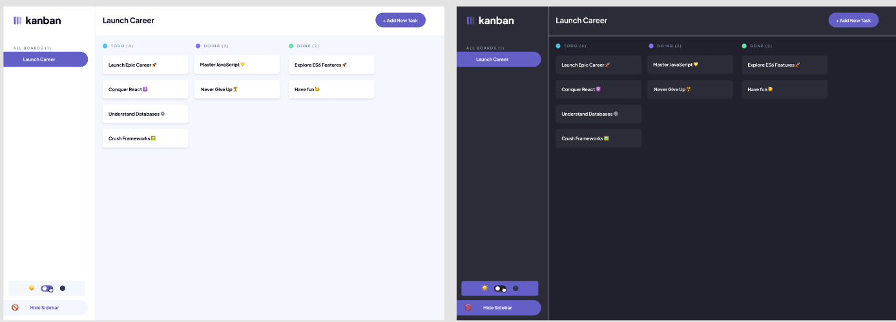
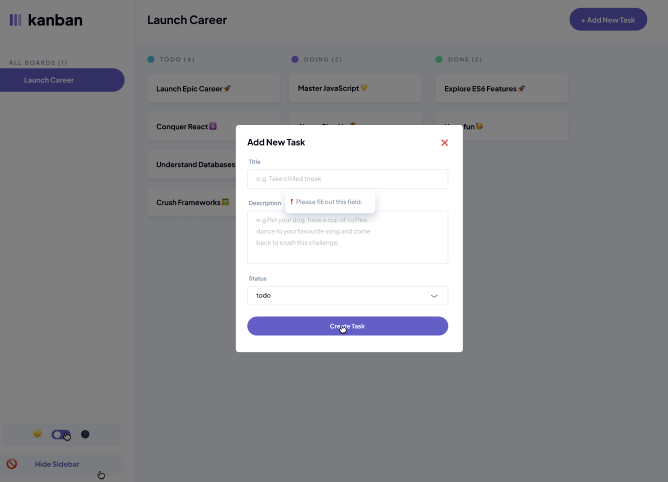
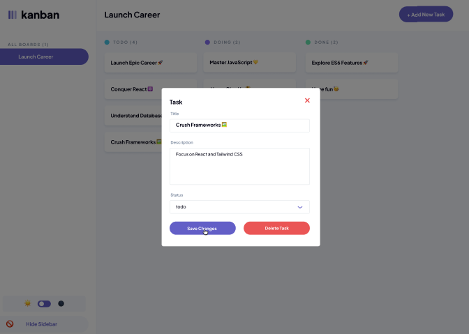

# JSL Portfolio Piece: Kanban | Task Manager

## 🚀 Brief : Kanban App Deployment & Features Implementation

💡*This project is a continuation of JSL05*

## Overview

This project involves **deploying a Kanban app to Netlify**, ensuring the app's functionality and persistence through local storage, and implementing dynamic features such as task editing, deletion, sidebar interaction, and a theme toggle. The goal is to deliver a fully functional, deployable application that is responsive across devices and maintains data consistency. Additionally, more focus will be directed to **clean, modular code** that is well-documented for future development.

## 📡 Deployed Web Application

> 🚀 **Deployed website (Netlify)** :https://kanbanboardcharme.netlify.app/
>
> 📽️ **Web Presentation (Loom)** :

---

## 💻 Project Technologies

 - Used for structuring the content and ensuring semantic, accessible layouts.

 - Styled the application with responsive designs and a visually appealing UI.

 - Implemented dynamic interactions, DOM manipulation, and logic for seamless user experience.

 - Project designed UI/UX layouts, wireframes, and prototypes for a consistent visual style.

 - Used for fast, reliable web deployment and continuous integration of the project.

## ✨ Key Features & Updates

### Core features

- ✅ Responsive layout with a three-column Kanban board
- ✅ Sidebar with custom branding and intuitive navigation
- ✅ Case-insensitive status input (e.g., `todo`,`Doing`, `DONE`)
- ✅ No Hard-Coded Tasks: All tasks are dynamically generated from JavaScript data, ensuring no hard-coded task content remains in the HTML.
- ✅ Semantic HTML and well-commented JavaScript for easy maintenance
- ✅Favicon Assets – SVG Icons

### New Features:

- 🗑️ Delete Task Option: The edit modal includes a "Delete Task" button to remove tasks from the board.

- 🌓 Web theme: Dark & Light mode integrated into both desktop and mobile views.

- 🔘 Toggles: Desktop and mobile toggles for the theme and a desktop togle for the side bar to be hidden.

- ➕ Add A New Task: Clicking the "add task" button opens a modal with a form validation attribute for the required title.

- 🆔 Unique Task IDs: Each new task is assigned a unique incremental ID, continuing from the last task in the array.

- 📝Editable Fields: Both modals offer input fields for updating the task title and description.

- ❌ Close Button: A clear 'X' button allows users to exit the modal without saving changes.

- 🔽 Status Dropdown: A dropdown lets users select and change the task status between "To Do", "Doing", and "Done".

- 📋 Backdrop Overlay: A semi-transparent overlay is included for visual focus and improved user experience.

- 💾 Save Changes: A "Save Changes" button instantly updates the task’s details and status on the board.

- ⚡ Task Persistence: Tasks are saved and loaded from localStorage, ensuring persistence across browser sessions.

## ⚙️ Code Quality & Maintainability

Consistent Naming Conventions: Descriptive and meaningful names are used throughout for variables, functions, and DOM elements, improving overall readability.

Comprehensive JSDoc Comments: All key functions are documented using JSDoc, providing clear descriptions, parameters, and return types for better developer understanding and onboarding.

Modular JavaScript Architecture: Logic is organized into well-defined, single-purpose functions like renderTasks, openTaskModal, addNewTask, updateTaskState, and deleteTask, promoting clarity and reusability.

## ⚙️ Set up instructions

💡*For use on your local machine IDE*

1. **Clone the Repository**

```bash
git clone
https://github.com/Charme-Lee/CHALIS24038_PTO2502_GroupA_Charme_Lishivha_JSLPP.git
```

2. **Open the Project Folder**

```bash
cd
CHALIS24038_PTO2502_GroupA_Charme_Lishivha_JSLPP
```

## 🚀 Usage Instructions

### ⚡ At Startup

- Open the Kanban app in your browser (e.g On Netlify).

#### ➕ **Add A New Task**

1. Click the **“+ Add New Task”** button in the top-right corner of the header.
2. Fill in the task **title** and **description** in the modal that appears.
3. Choose a **status** from the dropdown (🔽 _todo_, _doing_, _done_).
4. Click **“Create Task”** to add it to the appropriate column on the Kanban board.

#### ✏️ **Edit An Existing Task**

1. Click on any task card on the board.
2. The modal opens pre-filled with the task's details.
3. Update the **title**, **description**, or **status** as needed.
4. Click **“Save Changes”** to apply updates (task will move columns if status changes).

#### 🗑️ **Delete A Task**

1. Open a task by clicking its card.
2. In the modal, click the **“Delete Task”** button.
3. The task is instantly removed from the board.

#### ❌ **Close a Modal**

- To exit without saving, click the **‘X’ icon** in the top-right corner of any open modal.

## ✅ Usage Example

💡*For use on your local machine IDE or Netlify*

- Open index.html in a browser | Open the Netlify link

- The Kanban board displays tasks in "TODO," "DOING," and "DONE" columns.
  

- Click "+ Add New Task" in the header, fill in details, and click "Create Task" to add it to the board.
  

- Click any task card to open the "Edit Task" modal, edit details, and click "Save Changes" to update it.

- In the "Edit Task" modal, click "Delete Task" to remove a task.
  
- Resize the browser window to see the layout responsively adjust.

- Toggle the theme or hide the sidebar on the the desktop view

- The same features are available on mobile via the developer tools on the browser.
